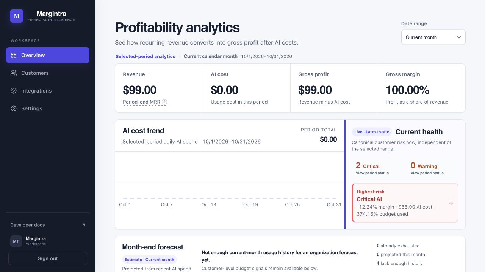
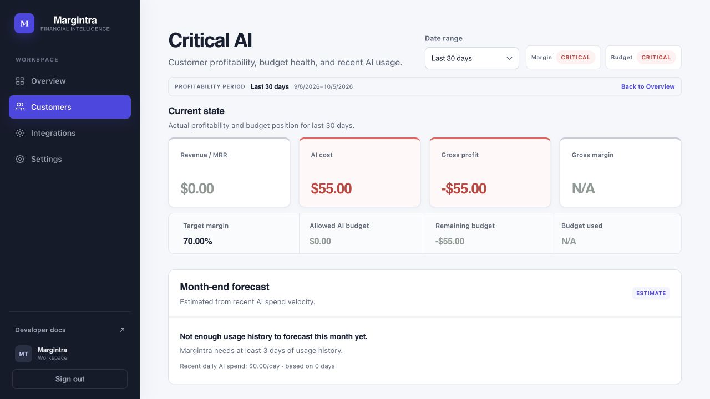
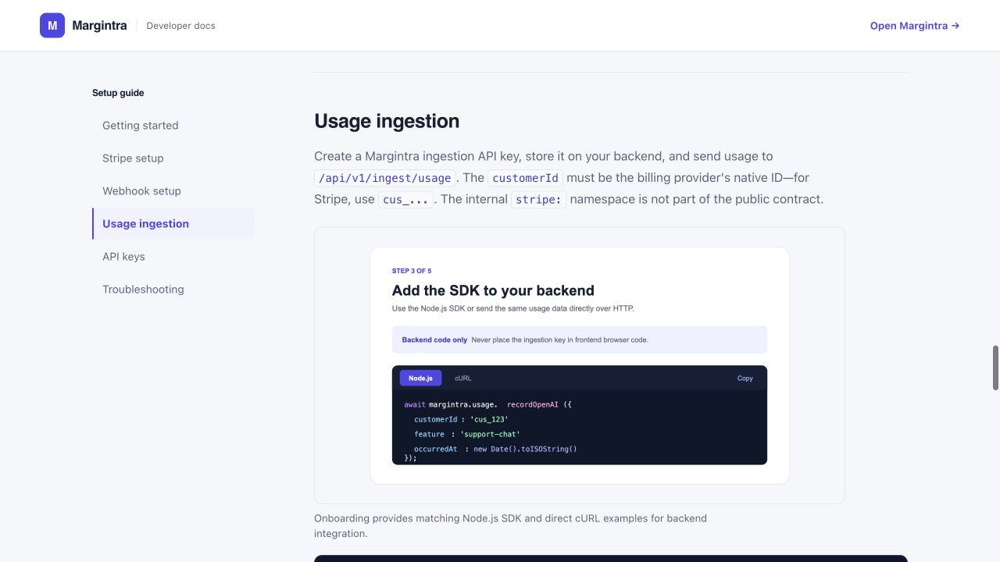

# Margintra

**AI profitability intelligence for SaaS products.**

Margintra combines subscription revenue with AI/LLM usage cost so SaaS teams can understand which customers, features, and models are profitable—and where margins need attention.



## Key features

- Stripe subscription and period-end MRR synchronization
- Durable asynchronous AI usage ingestion API and server-side Node.js SDK
- Customer revenue, AI cost, gross profit, and gross margin analytics
- Live customer health, guardrails, budget usage, and alert notifications
- Explainable month-end AI cost and budget-exhaustion forecasts
- Cost drivers by customer, feature, provider, and model
- Historical profitability, period comparison, and cost anomalies
- Versioned AI pricing catalog resolved by provider, model, and event time
- Durable `PendingPricing` recovery for usage from unknown models
- Organization-scoped API keys, tenant isolation, and idempotent processing
- Stripe-signed webhooks and encrypted billing credentials
- Public in-app developer documentation
- Production liveness, readiness, and Prometheus-compatible metrics

## Screenshots

| Overview | Customer profitability |
| --- | --- |
|  |  |
| Organization profitability, current health, trends, and forecast. | Period-scoped customer economics, budget health, and forecast. |

| Developer documentation |
| --- |
|  |
| In-app Stripe, webhook, API-key, and usage-ingestion guidance. |

## How it works

```mermaid
flowchart LR
    Stripe[Stripe] -->|customers, subscriptions, prices| Sync[Revenue sync and signed webhooks]
    App[Customer backend] -->|@margintra/node or Usage API| Inbox[Durable usage inbox]
    Inbox --> Worker[Usage worker]
    Worker --> Catalog[Versioned pricing catalog]
    Sync --> Postgres[(PostgreSQL)]
    Catalog --> Postgres
    Worker --> Postgres
    Postgres --> Analytics[Profitability analytics]
    Analytics --> Dashboard[Dashboard and alerts]
    Redis[(Redis)] -->|shared coordination and rate limits| Worker
    Redis --> Dashboard
```

PostgreSQL is the source of truth. An ingestion request succeeds only after its normalized event is durably committed; background processing then resolves pricing and updates profitability without holding the caller open.

## Technology

| Area | Stack |
| --- | --- |
| Backend | Node.js, NestJS, TypeScript, PostgreSQL, TypeORM, Redis, Decimal.js |
| Frontend | React, TypeScript, Vite |
| Infrastructure | Docker, Docker Compose, PostgreSQL, Redis, nginx |
| Integrations | Stripe, Resend |
| SDK | [`@margintra/node`](packages/margintra-node/README.md) |

## Quick start

### Prerequisites

- Node.js 24+ for local application development (the SDK supports Node.js 18+)
- Docker 24+ with Docker Compose
- OpenSSL for generating local secrets

```bash
git clone https://github.com/gugo1994/margintra.git
cd margintra
cp .env.example .env
```

Or clone over SSH:

```bash
git clone git@github.com:gugo1994/margintra.git
cd margintra
```

Set a strong `POSTGRES_PASSWORD`, a JWT secret of at least 32 random bytes, and a stable base64-encoded 32-byte billing encryption key in `.env`. For example, generate values locally with:

```bash
openssl rand -hex 32
openssl rand -base64 32
```

The development Compose file currently uses the existing external volume name `marginos_postgres_data`. Create it once on a fresh machine, then build and start the stack:

```bash
docker volume create marginos_postgres_data
docker compose up -d --build
```

Development defaults to demo seeding and the metadata-only email gateway. Never reuse development values in production.

### Local URLs

| Service | URL |
| --- | --- |
| Web application | [http://localhost:5173](http://localhost:5173) |
| Developer docs | [http://localhost:5173/docs](http://localhost:5173/docs) |
| NestJS API | [http://localhost:8081](http://localhost:8081) |
| Liveness | [http://localhost:8081/health/live](http://localhost:8081/health/live) |
| Readiness | [http://localhost:8081/health/ready](http://localhost:8081/health/ready) |
| Metrics | [http://localhost:8081/metrics](http://localhost:8081/metrics) |

PostgreSQL is exposed locally on port `55434`; Redis remains internal to the Compose network. Restrict `/metrics` to a monitoring network in production.

## AI usage ingestion

Create an ingestion key in **Integrations → Usage API keys**, keep it on your backend, and send usage to:

```http
POST /api/v1/ingest/usage
Content-Type: application/json
X-Margintra-Key: mtr_live_...
```

```json
{
  "externalRequestId": "req_01JEXAMPLE",
  "customerId": "cus_example123",
  "provider": "openai",
  "model": "gpt-5",
  "feature": "support-chat",
  "usage": {
    "inputTokens": 1200,
    "outputTokens": 350
  },
  "occurredAt": "2026-10-05T12:00:00Z"
}
```

`customerId` is the billing provider's native customer ID—for Stripe, a `cus_...` ID. A newly committed request returns HTTP `202` with its durable inbox ID and `processingStatus: "pending"`. The worker later calculates and persists immutable cost. `externalRequestId` provides tenant-scoped idempotency; a materially different replay returns `409`. Unknown model pricing is retained as `PendingPricing`, not dropped, and can resume after verified pricing is activated.

## Node.js SDK

The SDK is maintained in this repository at [`packages/margintra-node`](packages/margintra-node). After the package is published to npm, install it with:

```bash
npm install @margintra/node
```

```ts
import { Margintra } from '@margintra/node';

const margintra = new Margintra({
  apiKey: process.env.MARGINTRA_API_KEY!,
  baseUrl: 'https://your-margintra-api.example.com',
});

await margintra.usage.recordOpenAI({
  externalRequestId: response.id,
  customerId: stripeCustomerId,
  model: response.model,
  feature: 'support-chat',
  usage: {
    inputTokens: response.usage?.input_tokens ?? 0,
    outputTokens: response.usage?.output_tokens ?? 0,
  },
});
```

The SDK uses native `fetch`, has bounded timeout/retry behavior, sends only fields supplied by the developer, and is intended for server-side use. See the [SDK README](packages/margintra-node/README.md) for its complete behavior and privacy contract.

## Versioned pricing

Margintra resolves calculated cost using `provider + model + occurredAt`. Pricing versions are append-only, so accepted historical usage keeps its persisted cost even when current pricing changes. New or unknown models enter `PendingPricing`; an operator can add and activate verified pricing, after which covered events are requeued for the normal worker rather than recalculated inside the activation transaction.

## Security and data integrity

- Every dashboard and resource query is tenant-scoped.
- Ingestion keys are shown once and stored as scrypt hashes, never plaintext.
- Stripe credentials and webhook signing secrets are encrypted with AES-256-GCM.
- Stripe webhooks require valid signatures and use database-backed idempotency.
- Usage ingestion is durable and idempotent; inbox/outbox workers are safe across replicas.
- Sensitive headers, credentials, recipient addresses, prompts, and completions are excluded from structured logs.
- The SDK is server-side only and performs no hidden telemetry or application-data inspection.

These controls describe the implementation; they are not a claim of external compliance certification.

## Project structure

```text
backend-nest/             NestJS API, workers, TypeORM entities, and migrations
web/                      React dashboard and public in-app documentation
packages/margintra-node/  Server-side Node.js usage-ingestion SDK
docs/                     Product decisions and production operations guidance
```

## Documentation

- **Product setup:** run the app and open [`/docs`](http://localhost:5173/docs)
- **SDK contract:** [`packages/margintra-node/README.md`](packages/margintra-node/README.md)
- **Canonical product decisions:** [`docs/product-decisions.md`](docs/product-decisions.md)
- **Production deployment runbook:** [`docs/production-runbook.md`](docs/production-runbook.md)

## Development commands

Install each workspace with `npm ci` before running its commands.

```bash
# Backend
cd backend-nest
npm ci
npm run lint
npm run typecheck
npm run build
npm run test:unit -- <focused-test-pattern>

# Frontend
cd ../web
npm ci
npm run lint
npm run typecheck
npm run build

# Node SDK
cd ../packages/margintra-node
npm ci
npm run lint
npm run typecheck
npm run build
npm test
npm pack --dry-run
```

Database migrations are explicit. For local TypeScript migrations use `npm run migration:run` in `backend-nest`; production images use the separate `npm run migration:run:prod` command before API startup.

## Production status

The repository includes production-oriented multi-stage containers, a production Compose definition, a separate migration service, non-root application images, health/readiness checks, structured logging, graceful worker shutdown, and Prometheus-compatible metrics. A real deployment still requires externally managed DNS/TLS/reverse proxying, durable PostgreSQL backups, secret management, Stripe webhook configuration, a verified Resend sender/domain, and monitoring access controls.

No hosted public Margintra service is asserted by this repository.

## License

This repository currently has no license file. Copyright remains with the repository owner by default. Choose and add a license before inviting public reuse or open-source distribution.
